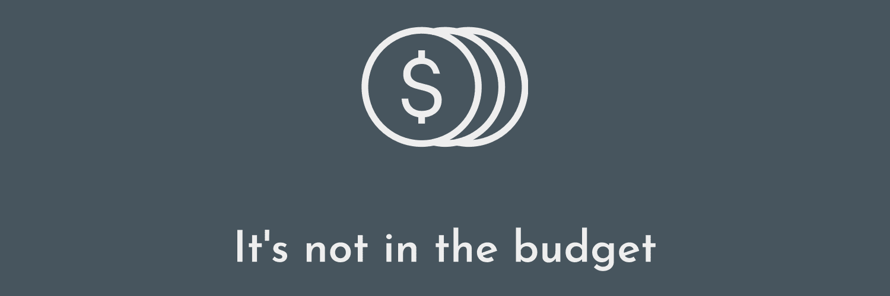

# It's not in the Budet &middot; [](https://travis-ci.org/npm/npm) [](https://www.npmjs.com/package/npm) [](http://makeapullrequest.com) [](https://github.com/your/your-project/blob/master/LICENSE)

> Staying on top of all those subscriptions 🙂

A budget tracking app built using React, Redux, Sass, and Webpack on the Front-End. The Back-End is using a combination of Express and
Firebase.

## [Demo](https://its-not-in-the-budget.herokuapp.com/)

## Installing / Getting started

A quick introduction of the minimal setup you need to launch the project in the browser.

```shell
- install needed dependencies
yarn
- run the start script and launch the app in the browser 💰
yarn start
```

### Built With

React, Redux, Sass, Express, Firebase, Webpack, and Babel.

### Setting up Dev

Here's a brief intro about what a developer must do in order to start developing
the project further:

```shell
git clone https://github.com/juliankohlman/its_not_in_the_budget
cd expenses/
packagemanager install
```

### Work in progress features & improvements

- Testing: I plan on adding full test coverage, possibly using the [react-testing-library](https://github.com/kentcdodds/react-testing-library) from Kent C. Dodds.
- Create a more visually appealing logo.
- Implement [animated page transisitions](https://veerasundar.com/blog/2018/12/how-to-animate-page-transition-in-react-using-styled-components/?utm_campaign=React%2BNewsletter&utm_medium=email&utm_source=React_Newsletter_144)
- ...and many more features and improvements to be added 👍
